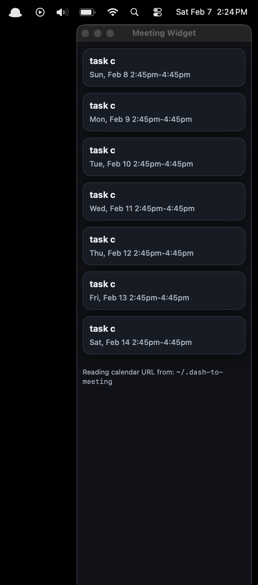

# Dash To Meeting

Mac desktop widget for viewing upcoming meetings and launching Zoom links directly.

## Screenshot



## Default source file

By default, the script reads your calendar source from:

```text
~/.dash-to-meeting
```

Put one URL/path in that file (first non-empty, non-comment line is used), for example:

```text
https://example.com/calendar.ics
```

Source resolution behavior:

- If you pass a CLI argument, that value is used as the source.
- If you do not pass a CLI argument, the script reads `~/.dash-to-meeting`.
- In `~/.dash-to-meeting`, blank lines and lines starting with `#` are ignored.
- The first remaining line is used as the source URL/path.
- If the file is missing, empty, or unreadable, the widget still opens and shows that error in HTML.

## Run

Use the default source file:

```bash
uv run ./dash-to-meeting.py
```

Override with a source directly:

```bash
uv run ./dash-to-meeting.py "<ics-url-or-local-path>"
```

## Stack

- Python 3.14
- `uv` (script runner + dependency resolution)
- Flask (local API server)
- icalevents (ICS parsing + recurring expansion)
- PyObjC (`AppKit` + `WebKit`) for native macOS widget window
- Vanilla HTML/CSS/JavaScript for UI rendering

## Features

- Uses a local Flask server plus a native macOS `WKWebView` window.
- Opens as a narrow, always-on-top widget on the right side of the screen.
- Uses plain HTML/CSS/JS (no frontend framework).
- Supports iCal sources via `http`, `https`, `webcal`, `file://`, or local file paths.
- Expands recurring events through `icalevents`.
- Converts event times to local timezone for display.
- Handles missing/invalid event end times by defaulting to 30 minutes.
- Normalizes title/description whitespace before rendering.
- Extracts Zoom links from event fields in this priority order: `location`, then `summary`, then `description`.
- Accepts Zoom URLs with or without scheme and normalizes to `https://...`.
- Shows title, time, optional description, and optional Zoom link text per event.
- Highlights the currently active event.
- Shows relative timing text such as `in 20 mins`, `current`, or `ended X mins ago` for same-day events.
- Makes the full event card clickable when a Zoom link exists.
- Calls backend `/open` endpoint to launch links.
- Converts eligible Zoom links to native `zoommtg://...` join URLs (`/j/<id>`, `/w/<id>`, or `confno` query).
- Falls back to opening the original Zoom URL if native conversion is not possible.
- Exits the app shortly after opening a meeting link.
- Refreshes event data every 5 minutes and refreshes relative labels every 30 seconds.
- Shows `~/.dash-to-meeting` in the HTML header as the default source-file location.
- Shows backend source-loading errors directly in HTML when loading fails.

## Made By

Made by you and Codex.
